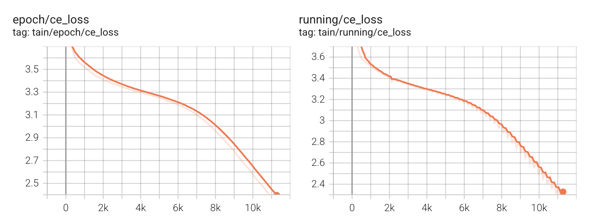

# VQ-GAN + Transformer on CelebA

This repository contains code to train a **VQ-GAN** model on the CelebA dataset, and then train a Transformer (GPT-like model) on the learned discrete latent space for image generation. **It supports DDP training**.

The project is inspired by the "**Taming Transformers for High-Resolution Image Synthesis**" paper, but streamlined to work with a single dataset (CelebA) for simplicity.

# Main Components

### 1. VQ-GAN Training

Trains a Vector Quantized Generative Adversarial Network (VQ-GAN) on CelebA.

Includes perceptual loss (LPIPS), adversarial loss, and commitment loss.

After training, you get a discrete codebook and a decoder to reconstruct images.

### 2. Transformer Training

Trains a Transformer to model sequences of VQ-GAN codebook indices.

At inference time, the Transformer generates latent codes, and the VQ-GAN decoder turns them into full images.

# Setup

## Clone repository

```bash
git clone <your-repo-url>
cd <repo-name>
```

## Install dependencies

```bash
pip install -r requirements.txt
```

## Download Celeba 256 dataset

[From Kaggle](https://www.kaggle.com/datasets/badasstechie/celebahq-resized-256x256)

# Training

### Step 1: Train VQ-GAN

```bash
python src/train_vqgan.py data_path=<path-to-celeba-dataset> log_dir=<where-to-store-logs>
```

I trained this model for ~9 hours (52 epochs) using 2x Nvidia 4090 GPUs.

```bash
torchrun --standalone --nnodes --nproc_per_node=2 src/train_vqgan.py data_path=<path-to-celeba-dataset> log_dir=<where-to-store-logs> batch_size=24 num_workers=8 lr=4.2e-5 disc_start=630 ddp=True
```

## Discriminator loss


## Generator loss


## VQ-VAE loss components


## VQ-GAN loss


### Step 2: Train Transformer

```bash
python src/train_transformer.py data_path=<path-to-celeba-dataset> log_dir=<where-to-store-logs> vqgan_weights=<path-to-vqgan-checkpoint-from-step-1>
```

I trained this model for ~9 hours (47 epochs) using 2x Nvidia 4090 GPUs.

```bash
torchrun --standalone --nnodes --nproc_per_node=2 src/train_transformer.py data_path=<path-to-celeba-dataset> log_dir=<where-to-store-logs> batch_size=64 num_workers=8 lr=1.4e-4 ddp=True
```



# Inference

After both models are trained:

```bash
python scripts/generate_images.py
```

This script samples new images by generating discrete codes with the Transformer and decoding them with the VQ-GAN decoder. See `configs/generate_images.yaml` for configuring the sampling process.

Acknowledgments

1. [Taming Transformers for High-Resolution Image Synthesis](https://arxiv.org/abs/2012.09841)
2. [Video explanation](https://www.youtube.com/watch?v=wcqLFDXaDO8) | [Video implementation](https://www.youtube.com/watch?v=_Br5WRwUz_U)

Notes

This project is simplified for research/educational purposes and focuses only on the CelebA dataset.
